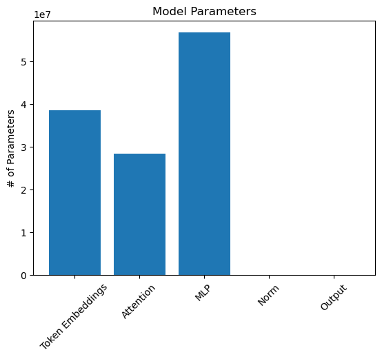
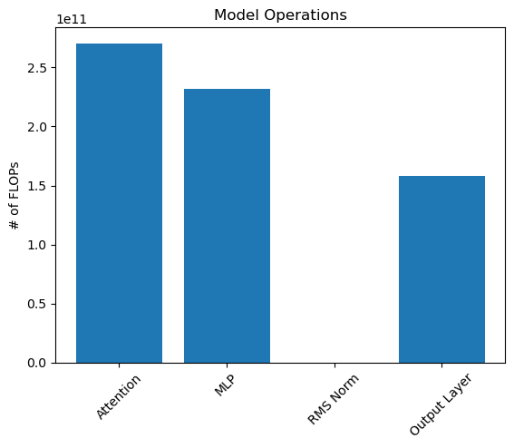

# Memory and Compute Requirement

[Notebook Link](./reference/S29.ipynb)

This notebook is a simple tool to estimate the memory and compute requirements for the solution of the problem. The notebook is divided into two sections: the first one is dedicated to the memory requirements, while the second one is dedicated to the compute requirements.



```bash
Token Embeddings               38,597,376      31.24%
Attention                      28,311,552      22.91%
MLP                            56,623,104      45.83%
Norm                               19,200       0.02%
Output                                  0       0.00%
Total parameters: 123,551,232
```


## Aspect Ratio

To get an idea of the "shape" of our neural network we'll look at the ratio of embeding dimensions to number of layers. Generally, a aspect ratio betweem 50 and 100 is considered optimal according to certain scaling laws (Kaplan et al., 2020).

```python
aspect_ratio = embedding_dimensions / num_hidden_layers

print(f"Network has an aspect ratio of {aspect_ratio:.2f}")
```

```bash
Network has an aspect ratio of 64.00
```


## Heads Ratio

We can do the same abalysis for the ratio of embedding dimensions to the number of attention heads. A ratio between 20 and 80 is considered optimal according to the same paper.

```python
heads_ratio = embedding_dimensions / num_attention_heads

print(f"Heads ratio is {heads_ratio:.2f}")
```

```bash
Heads ratio is 64.00
```


## Model Size

Next, we'll estimate the size of the model in memory and on disk. Note that this does not include any intermediate variables that get memorized during training such as activations, gradients, optimizer state, and temporary buffers. Actual memory consumption will likely be much higher. 

```python
bytes_per_parameter = 32 // 8  # Assuming 32-bit floating point

total_bytes = total_parameter_count * bytes_per_parameter

total_gigabytes = total_bytes / 1e9

print(f"Total gigabytes: {total_gigabytes:,.2f}G")
```

```bash
Total gigabytes: 0.49G
```


## Training Tokens

We can estimate the optimal number of training tokens using the Chinchilla scaling laws given the number of parameters

```python
num_training_tokens = 20 * total_parameter_count
samples_per_epoch = 512
tokens_per_sample = 2048
num_epochs_required = round(
    num_training_tokens / (samples_per_epoch * tokens_per_sample)
)
print(f"Optimal training tokens: {num_training_tokens:,}")

print(f"Epochs required: {num_epochs_required:,}", end="\n\n")
```

```bash
Optimal training tokens: 2,471,024,640
Epochs required: 2,357
```


## FLOPs

Next, we'll estimate the maximum number of floating point operations (FLOPs) required to perform a full forward pass of the nwtwork on a single sample.

```python
ops_per_matmul = 2 # Multiply + accumulate (MAC)
# ops_per_activation = 5 # Assuming SiLU
ops_per_activation = 6 # Assuming GeLU
ops_per_rms_norm = 7 # y = x / sqrt(sum(x^2) / n + epsilon) * gamma
head_dimensions = embedding_dimensions // num_attention_heads

# K, Q, V projections
attention = (
    ops_per_matmul
    * tokens_per_sample
    * (embedding_dimensions * 3 * embedding_dimensions)
)

# Attention logits
attention += (
    ops_per_matmul * tokens_per_sample * tokens_per_sample * embedding_dimensions
)

# Reductions
attention += (
    ops_per_matmul
    * num_attention_heads
    * (tokens_per_sample * tokens_per_sample * head_dimensions)
)

# Output projection
attention += ops_per_matmul * tokens_per_sample * embedding_dimensions**2

attention *= num_hidden_layers

# Linear transformations
mlp = (
    ops_per_matmul
    * tokens_per_sample
    * (embedding_dimensions * (4 * embedding_dimensions))
)
mlp += (
    ops_per_matmul
    * tokens_per_sample
    * ((4 * embedding_dimensions) * embedding_dimensions)
)

# Non-linear activations
mlp += ops_per_activation * (4 * embedding_dimensions)

mlp *= num_hidden_layers

rms_norm = ops_per_rms_norm * embedding_dimensions * (num_hidden_layers + 1)

output_layer = (
    ops_per_matmul * tokens_per_sample * embedding_dimensions * vocabulary_size
)

flops = {
    "Attention": attention,
    "MLP": mlp,
    "RMS Norm": rms_norm,
    "Output Layer": output_layer,
}

plt.bar(flops.keys(), flops.values())

plt.title("Model Operations")
plt.ylabel("# of FLOPs")
plt.xticks(rotation=45)

plt.show()

total_forward_flops = sum(flops.values())

for name, count in flops.items():
    print(f"{name:20s} {count:20,d} {count / total_forward_flops * 100:10.2f}%")

print("\n")

print(f"Total forward FLOPs: {total_forward_flops:,}")
```



```bash
Attention                 270,582,939,648      40.96%
MLP                       231,928,455,168      35.11%
RMS Norm                           69,888       0.00%
Output Layer              158,094,852,096      23.93%


Total forward FLOPs: 660,606,316,800
```

Next, we'll estimate the number of FLOPs for the backward pass. For this we use a simple heuristic of 2x the forward pass

```python
total_backward_flops = 2 * total_forward_flops

print(f"Total backward FLOPs: {total_backward_flops:,}")
```

```bash
Total backward FLOPs: 1,321,212,633,600
```


We'll do the same for the total FLOPs per roundtrip.

```python
total_roundtrip_flops = total_forward_flops + total_backward_flops
print(f"Total roundtrip FLOPs: {total_roundtrip_flops:,}")
```

```bash
Total roundtrip FLOPs: 1,981,818,950,400
```


## Training Time Required

Finally, let's estimate how long it would take to train over the optimal number of tokens given some common Nvidia Ampere generation GPU hardware configurations. Note that these results shown here are a theoretical scenario and do not factor in additional overhead such as activation checkpointing or network latency.

```python
from dataclasses import dataclass


@dataclass
class Device:
    name: str
    advertised_flops: float
    mfu: float

    @property
    def actual_flops(self) -> float:
        return self.mfu * self.advertised_flops


devices = [
    Device("RTX A2000", 63.9e12, 0.17),
    Device("RTX A4000", 153.4e12, 0.19),
    Device("RTX 3090", 285.5e12, 0.23),
    Device("A100 SXM", 624.0e12, 0.37),
    Device("HGX A100", 4992e12, 0.30),
]

for device in devices:
    seconds_per_epoch = samples_per_epoch * total_roundtrip_flops / device.actual_flops

    days_required = num_epochs_required * seconds_per_epoch / 60 / 60 / 24

    print(
        f"{device.name}: {seconds_per_epoch:.2f} seconds/epoch, {days_required:,.2f} days required"
    )
```

```bash
RTX A2000: 93.41 seconds/epoch, 2.55 days required
RTX A4000: 34.81 seconds/epoch, 0.95 days required
RTX 3090: 15.45 seconds/epoch, 0.42 days required
A100 SXM: 4.39 seconds/epoch, 0.12 days required
HGX A100: 0.68 seconds/epoch, 0.02 days required
```

